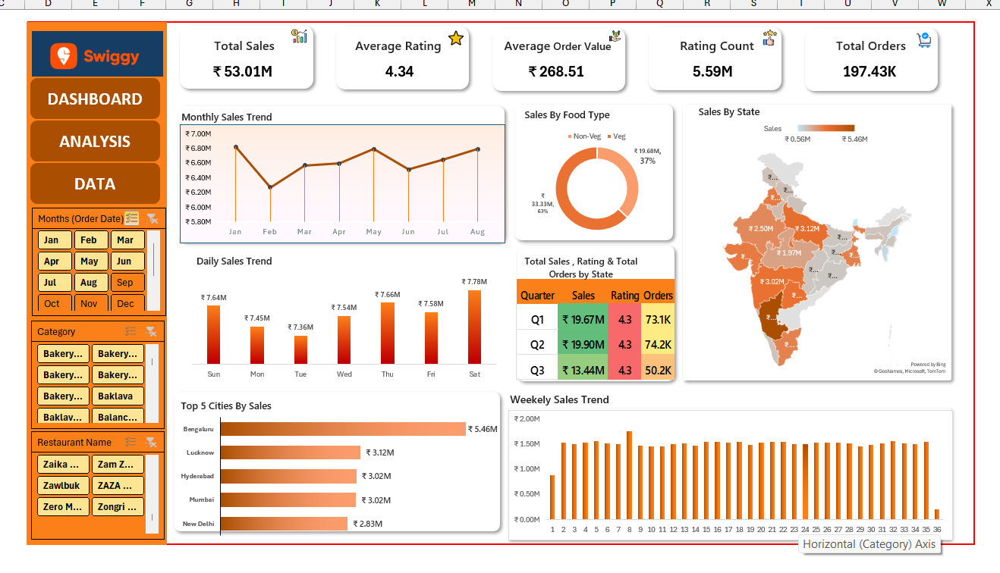

# 🍔 Swiggy Sales Analysis Dashboard (Excel)

An interactive Excel dashboard analyzing ~197K Swiggy food delivery orders across 28 Indian states — built entirely with native Excel tools (PivotTables, PivotCharts, slicers, map charts, and KPI cards).

## 📊 Overview

This dashboard turns a raw, order-level Swiggy dataset into a decision-ready sales report covering revenue trends, food preferences, geographic performance, and top-performing cities/restaurants.

**Key Metrics:**
| Metric | Value |
|---|---|
| Total Sales | ₹53.01M |
| Total Orders | 197.43K |
| Average Order Value | ₹268.51 |
| Average Rating | 4.34 |

## 🗂️ Dataset

- **Rows:** ~197,000 individual food orders
- **Columns:** State, City, Order Date, Day, Quarter, Week, Restaurant Name, Location, Category, Dish Name, Food Type (Veg/Non-Veg), Price, Rating, Rating Count
- **Coverage:** 28 states, ~5,000 restaurant categories/cuisines
- Source:  Practice dataset used for self-learning Excel dashboarding

## 📈 Dashboard Features

- **KPI Cards:** Total Sales, Average Rating, Average Order Value, Rating Count, Total Orders
- **Monthly & Weekly Sales Trend** — line and column charts tracking revenue over time
- **Daily Sales Trend** — sales broken down by day of week
- **Sales by Food Type** — Veg vs. Non-Veg split (donut chart)
- **Sales by State** — geographic heat map of India
- **Total Sales, Rating & Orders by Quarter** — summary table
- **Top 5 Cities by Sales** — horizontal bar chart
- **Interactive Slicers** — filter by Month, Category, and Restaurant Name

## 🛠️ Tools & Techniques

- Microsoft Excel (PivotTables, PivotCharts, Slicers, Map Charts)
- Data cleaning & structuring of raw order-level data
- DAX-free KPI calculations using Excel formulas
- Dashboard UX design (single-page, filter-driven layout)

## 📁 Files in This Repo

- `Swiggy_Raw_Data_Excel.xlsx` — full dashboard workbook (raw data + dashboard sheet)
- `dashboard_preview.png` — screenshot of the finished dashboard
- `README.md` — this file

## 💡 Key Insights

- Bengaluru leads all cities in total sales (₹5.46M), followed by Lucknow and Hyderabad
- Non-Veg orders account for 63% of sales despite Veg options being widely available
- Q1 and Q2 outperform Q3 in both sales and order volume

## 👤 Author

**Manish Saini**
[LinkedIn](https://linkedin.com/in/manish-saini24) · [GitHub](https://github.com/manish-analytics)
